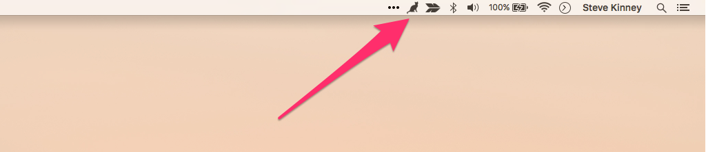
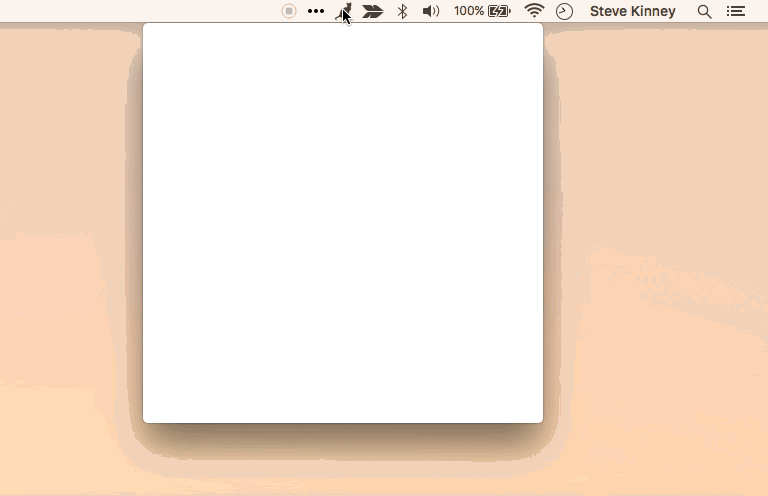
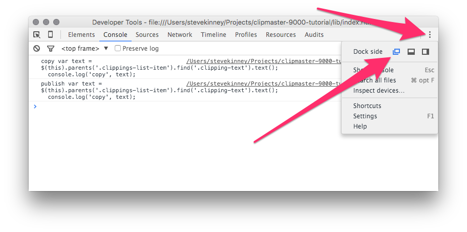

# Clipmaster 9000

This is a tutorial for building a clipboard manager using Electron. It is meant to accompany my session on _Building a desktop application with Electron_ ([Part 1][] and [Part 2][]) at [O'Reilly's Fluent Conference 2016][fluent].

[Part 1]: http://conferences.oreilly.com/fluent/javascript-html-us/public/schedule/detail/46730
[Part 2]: http://conferences.oreilly.com/fluent/javascript-html-us/public/schedule/detail/47788
[fluent]: http://conferences.oreilly.com/fluent/javascript-html-us

## Getting Started and Acclimated

To get started, clone this repository and install the dependencies using `npm install`.

We'll be working with four files for the duration of this tutorial:

- `lib/main.js`, which will contain code for the main process
- `lib/renderer.js`, which will code for the renderer process
- `lib/index.html`, which will contain the HTML for the user interface
- `lib/style.css`, which will contain the CSS to style the user interface

In a more robust application, you might break stuff into smaller files, but—for the sake of simplicity—we're not going to.

## Hello Menubar

In this application, we're going to use [Max Ogden's excellent _menubar_ module][menubar-repo]. This module abstracts some of the OS-specific implementation details of building a application that lives in the menu bar (OS X) or system tray (Windows).

[menubar-repo]: https://github.com/maxogden/menubar

In `main.js`, we'll get things rolling by including Electron and menubar.

```js
const electron = require('electron');
const Menubar = require('menubar');
```

 The `Menubar` is a constructor. We'll create an instance to work with.

 ```js
 const menubar = Menubar();
 ```

 In this case our `menubar` instance is very simular to `app` in [Fire Sale][]. We'll wait for the application to be fire a `ready` event and then we'll log to the console.

 [Fire Sale]: https://github.com/stevekinney/firesale-tutorial

```js
menubar.on('ready', function () {
  console.log('Application is ready.');
});
```

Let's use `npm start` to verify that it works correctly. The library gives us a pleasant little cat icon as a default.



We also get a window correctly positioned above or below—depending on your operating system—the icon, which will load a blank page for starters. This is an instance of `BrowserWindow` as we saw before in [Fire Sale][].




### Loading Our HTML File

As we alluded to just a sentence or two ago, Menubar will create a `BrowserWindow` on our behalf. When it has done so, it will fire a `after-create-window` event. We can listen for this event and load our HTML page accordingly.

```js
menubar.on('after-create-window', function () {
  menubar.window.loadURL(`file://${__dirname}/index.html`);
});
```

## Implementing The Renderer Functionality

With menubar application up and running, it's time to shift our focus to the implementing the application's primary functionality.

When a user clicks the "Copy from Clipboard" button, we want to read from the clipboard and add that new clipping to the list.

We can make a few assumptions off the bat:

1. We'll need access to Electron's `clipboard` module.
1. We'll want a reference to the "Copy From Clipboard" button.
1. We'll want a reference to the clippings list in order to add our clippings later on.

Let's implement all three in one swift motion:

```js
const clipboard = electron.clipboard;

const $clippingsList = $('.clippings-list');
const $copyFromClipboardButton = $('#copy-from-clipboard');
```

Building the element that will display our clipping can be tedious. In the interest of time and focus, I've provided a function that will take some text and return a jQuery-wrapped DOM node that's ready to be appended to the clippings list.

```js
const createClippingElement = require('./support/create-clipping-element');
```

Spoiler alert: we'll eventually want to trigger reading from the clipboard by other means. So, let's keep break this functionality out into it's own function so that we can use it in multiple places.

```js
function addClippingToList() {
  var text = clipboard.readText();
  var $clipping = createClippingElement(text);
  $clippingsList.append($clipping);
}
```

Now, when a user clicks the "Copy from Clipboard" button, we'll read from the clipboard and add that clipping to the list.

```js
$copyFromClipboardButton.on('click', addClippingToList);
```

If all went well, our `renderer.js` looks something like this:

```js
const $ = require('jquery');
const electron = require('electron');

const clipboard = electron.clipboard;

const $clippingsList = $('.clippings-list');
const $copyFromClipboardButton = $('#copy-from-clipboard');
const createClippingElement = require('./support/create-clipping-element');

function addClippingToList() {
  var text = clipboard.readText();
  var $clipping = createClippingElement(text);
  $clippingsList.append($clipping);
}

$copyFromClipboardButton.on('click', addClippingToList);
```

Let's fire up our application and take it for a spin.

## Wiring Up Our Actions

We have three buttons on each clipping element.

1. "→ Clipboard" will write that clipping back to the clipboard.
1. "Publish" will send it up to an API that we can share.
1. "Remove" will remove it from the list.

We'll take advantage of [event delegation][], in order to avoid memory leaks. _Disclaimer_, we'll do this in the quickest—not necessarily the best—possible way in order to get back to focusing on Electron concepts.

[event delegation]: https://github.com/mdn/advanced-js-fundamentals-ck/blob/gh-pages/tutorials/04-events/05-event-delegation.md

Let's implement event listeners for all three. We'll use dummy functionality for "copy" and "publish".

```js
$clippingsList.on('click', '.remove-clipping', function () {
  $(this).parents('.clippings-list-item').remove();
});

$clippingsList.on('click', '.copy-clipping', function () {
  var text = $(this).parents('.clippings-list-item').find('.clipping-text').text();
  console.log('COPY', text);
});

$clippingsList.on('click', '.publish-clipping', function () {
  var text = $(this).parents('.clippings-list-item').find('.clipping-text').text();
  console.log('PUBLISH', text);
});
```

Let's head back over to our application to verify that everything works. You can fire open developer tools using <kbd>Command-Option-I</kbd> or <kbd>Control-Option-I</kbd> for OS X and Windows respectively. I like to break them out to their own window.



## Writing Text to the Clipboard.

In the previous code we just wrote, we were just logging the clipping's contents to the console. Let's write it to the clipboard instead.

```js
$clippingsList.on('click', '.copy-clipping', function () {
  var text = $(this).parents('.clippings-list-item').find('.clipping-text').text();
  clipboard.writeText(text);
});
```

## Publishing to a Gist

Let's say we have a clipping that is super important. It's so important that we just want to share it with the world. Well, if it's that important than we'll probably want to get that publish button working.

In a normal browser environment, we couldn't just send a AJAX request to some remote server at a different domain. The browser's security features won't allow that. Instead, we'd have to have send the request to our own server (maybe it's written in Node) and have our server send the HTTP request to the remote server. This is where Electron's privileged status as a Node application shines.

We'll bring in the [Request][] library.

[Request]: https://github.com/request/request

```js
const request = require('request');
```

Now, one of the most dense pieces of code we're going to write today will be the HTTP request. We'll be using [Github's Gist API][gistapi]. We'll need to set three important pieces of information:

[gistApi]: https://developer.github.com/v3/gists/

1. The URL of the Gist API
1. A User-Agent (the Gist API requires this)
1. A body with the text we'd like to use formatted in a particular way

Our data will look as follows:

```js
{
  url: 'https://api.github.com/gists',
  headers: {
    'User-Agent': 'Clipmaster 9000'
  },
  body: JSON.stringify({
    description: "Created with Clipmaster 9000",
    public: "true",
    files:{
      "clipping.txt": {
        content: text
      }
    }
  }
})
```

We'll send that information using `request.post`. Request takes a callback function that it will execute when it hears back from the server. The callback function will be handed three arguments: `error`, `response`, and `body`.

We'll start by using alerts to notify the user of the success or failure of our API request. We'll also write the URL of the new gist to the clipboard if it was successful.

```js
$clippingsList.on('click', '.publish-clipping', function () {
  var text = $(this).parents('.clippings-list-item').find('.clipping-text').text();
  request.post({
    url: 'https://api.github.com/gists',
    headers: {
      'User-Agent': 'Clipmaster 9000'
    },
    body: JSON.stringify({
      description: "Created with Clipmaster 9000",
      public: "true",
      files:{
        "clipping.txt": {
          content: text
        }
      }
    })
  }, function (err, response, body) {
    if (err) { return alert(JSON.parse(err).message); }

    var gistUrl = JSON.parse(body).html_url;
    alert(gistUrl);
    clipboard.writeText(gistUrl);
  });
});
```

## Using Notifications

**A Note About Notifications**: Notifications work out of the box on Windows 10 and OS X. In earlier versions of Windows, you'll have to take some additional steps. We're going to move forward assuming you're using either OS X or Windows 10, but you can totally check out [this documentation][notifs] for more details.

[notifs]: http://electron.atom.io/docs/v0.36.8/tutorial/desktop-environment-integration/#notifications-windows-linux-os-x

Here's a little snipped form the [documentation][notifs] demonstrating how to use notifications.

```js
var myNotification = new Notification('Title', {
  body: 'Lorem Ipsum Dolor Sit Amet'
});

myNotification.onclick = function () {
  console.log('Notification clicked')
};
```

Let's replace our alerts with notifications. We'll be modifying the callback in the Request callback from just a few minutes ago:

```js
function (err, response, body) {
  if (err) {
    return new Notification('Error Publishing Your Clipping', {
      body: JSON.parse(err).message
    });
  }

  var gistUrl = JSON.parse(body).html_url;
  var notification = new Notification('Your Clipping Has Been Published', {
    body: `Click to open ${gistUrl} in your browser.`
  });

  notification.onclick = function () {
    electron.shell.openExternal(gistUrl);
  };

  clipboard.writeText(gistUrl);
})
```

## Adding Global Shortcuts

Electron can register global shortcuts with the operating system. Let's take this for a spin in `main.js`.

We'll start by creating a reference to Electron `globalShortcut` module.

```js
const globalShortcut = electron.globalShortcut;
```

When the `ready` event is fired, we'll register our shortcut.

```js
menubar.on('ready', function () {
  console.log('Application is ready.');

  var createClipping = globalShortcut.register('CommandOrControl+!', function () {
    console.log('This will eventually trigger creating a new clipping.');
  });

  if (!createClipping) { console.log('Registration failed', 'createClipping'); }
});
```

In our specific application, all of our clippings are managed by the renderer process. So, when the global shortcut is hit, we'll have to let the renderer process know.

Let's modify the event listener to send a message to the renderer process.

```js
var createClipping = globalShortcut.register('CommandOrControl+!', function () {
  menubar.window.webContents.send('create-new-clipping');
});
```

In `renderer.js`, we'll listen for this message. First, we'll require the `ipcRenderer` module.

```js
const ipc = electron.ipcRenderer;
```

We'll then listen for an event on the `create-new-clipping` channel.

```js
ipc.on('create-new-clipping', function (event) {
  addClippingToList();
  new Notification('Clipping Added', {
    body: `${clipboard.readText()}`
  });
});
```

We won't do this now, because it's more of the same. But could add additional shortcuts to our application as well.

```js
var copyClipping = globalShortcut.register('CmdOrCtrl+Alt+@', function () {
  menubar.window.webContents.send('clipping-to-clipboard');
});

var publishClipping = globalShortcut.register('CmdOrCtrl+Alt+#', function () {
  menubar.window.webContents.send('publish-clipping');
});
```
